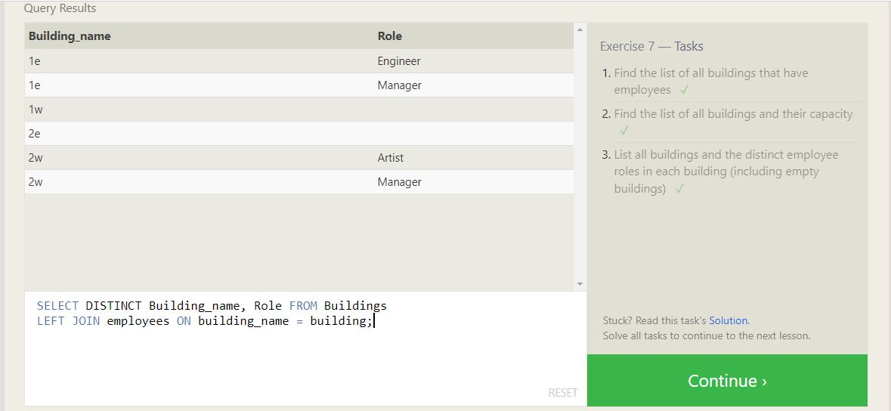
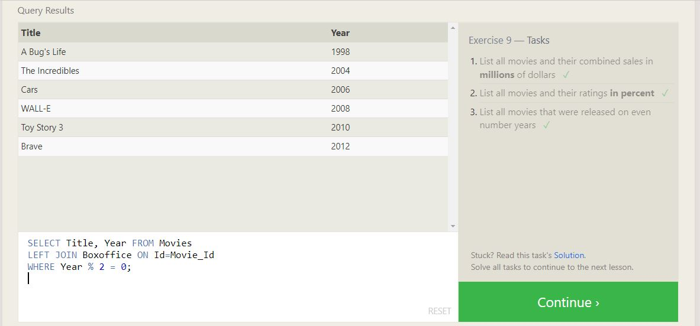

# SQL Practice (Ultimate Guide)

    SQL is a language used to query and manipulate data from a relational database. 
    A relational database is made up of related tables that contain fixed named columns and rows of data. 
    SQL is useful for answering specific questions about data, such as "What types of vehicles have less than four wheels on the road?" 
    or "How many models of cars does Tesla produce?" This information can help us make better decisions in the future.

    Although SQL languages all share a basic structure, some of the specific
    commands and styles can differ slightly. Popular dialects include MySQL,
    SQLite, SQL Server, Oracle SQL, and more. PostgreSQL is a good place to start
    —since it’s close to standard SQL syntax and is easily adapted to other
    dialects. 

## SQL Lesson 1: SELECT queries 101

   To get data from a SQL database, we use SELECT statements, also called queries. A query is a statement that specifies what data we want, where to find it in the database, and how to transform it before returning it.

    Syntax: 
    SELECT column_name(s)
    FROM table_name;

    SELECT *
    FROM table_name;

ps: the (*) stands for all.

## SQL Lesson 2: Queries with constraints (Pt. 1)

Queries with constraints are used to retrieve data from a database that meets specific conditions. This is done using the WHERE clause in a SELECT statement.

    Syntax:
    SELECT column_name(s)
    FROM table_name
    WHERE condition;

## SQL Lesson 3: Queries with constraints (Pt. 2)

In addition to basic conditions using the WHERE clause, we can also use other operators and functions to create more complex constraints. Here are some examples:

1. Using the LIKE operator to match patterns:

        SELECT column_name(s)
        FROM table_name
        WHERE column_name LIKE 'pattern';
2. Using the IN operator to match a value against a list:

        SELECT column_name(s)
        FROM table_name
        WHERE column_name IN (value1, value2, ...);
3. Using the BETWEEN operator to match a value within a range:

        SELECT column_name(s)
        FROM table_name
        WHERE column_name BETWEEN value1 AND value2;
4. Using logical operators to combine conditions:

        SELECT column_name(s)
        FROM table_name
        WHERE condition1 AND condition2 AND ...;

## SQL Lesson 4: Filtering and sorting Query results

To filter query results in SQL, we use the WHERE clause to specify one or more conditions that the rows must meet.

Sorting Results:
To sort query results in SQL, we use the ORDER BY clause to specify one or more columns to sort on, and the direction of the sort (ascending or descending).

        SELECT column_name(s)
        FROM table_name
        WHERE condition
        ORDER BY column_name(s) [ASC|DESC]
        LIMIT n OFFSET m;

Using Aggregate Functions:
Aggregate functions allow us to perform calculations on groups of rows and return a single result.

Using Group By:
The GROUP BY clause is used to group rows that have the same values into summary rows, like "find the total number of orders for each customer."

        SELECT column_name, aggregate_function(column_name)
        FROM table_name
        WHERE condition
        GROUP BY column_name;

Using Subqueries:
A subquery is a query within another query, which allows us to retrieve data based on values from another table or from the same table.

        SELECT column_name(s)
        FROM table_name
        WHERE column_name OPERATOR
        (SELECT column_name(s)
        FROM table_name
        WHERE condition);

ps: operator like (IN).

## SQL Review: Simple SELECT Queries

A review of all the above.

## SQL Lesson 6: Multi-table queries with JOINs

Multi-table queries with JOINs allow us to combine data from multiple tables in a single result set. This is useful when we need to analyze data from related tables or when we need to retrieve data that cannot be found in a single table.

There are different types of JOINs in SQL, including INNER JOIN, LEFT JOIN, RIGHT JOIN, and FULL OUTER JOIN. Each type of JOIN returns a different result set, depending on the relationship between the tables being joined.

LEFT JOIN: Returns all rows from the left table and matching rows from the right table, and fills in NULL values for non-matching rows in the right table.

RIGHT JOIN: Returns all rows from the right table and matching rows from the left table, and fills in NULL values for non-matching rows in the left table.

CROSS JOIN: Returns the Cartesian product of both tables (i.e. every combination of rows from both tables).

        SELECT DISTINCT column_name(s)
        FROM table1
        INNER/LEFT/RIGHT/FULL OUTER/CROSS JOIN table2
        ON table1.column = table2.column WHERE condition;

Aliases for table names: (advanced)

        SELECT column_name(s)
        FROM table_name AS alias_name
        WHERE condition;

Joining multiple tables at once: (advanced)

        SELECT column_name(s)
        FROM table1 AS alias1
        JOIN table2 AS alias2
        ON alias1.column = alias2.column
        JOIN table3 AS alias3
        ON alias2.column = alias3.column
        WHERE condition;

ps: The DISTINCT keyword is used to remove duplicate rows from the result set. It can be placed immediately after the SELECT keyword and before the column names

## SQL Lesson 7: OUTER JOINs

FULL OUTER JOIN: Returns all rows from both tables, filling in NULL values for non-matching rows on both sides.

## SQL Lesson 8: A short note on NULLs

Here are some important things to keep in mind when working with NULL values in SQL:

Comparison with NULL using the = operator will always return false. Use the IS NULL or IS NOT NULL operators instead.

When performing arithmetic operations, any expression involving NULL will evaluate to NULL.

The aggregate functions COUNT, SUM, AVG, MAX, and MIN ignore NULL values, unless specified otherwise with the DISTINCT keyword.

When using JOINs, be aware that NULL values in join columns can cause unexpected results, since NULL does not equal anything, not even another NULL.

Overall, it's important to be cautious when working with NULL values in SQL, and to consider the behavior of NULL in any queries that involve it.

## SQL Lesson 9: Queries with expressions

In SQL, expressions are combinations of one or more values, operators, and functions that evaluate to a single value(). They can be used in SELECT statements to transform data, calculate new values, or filter results based on certain conditions.
Expressions: To use expressions in a SELECT statement, you can simply specify the expression using arithmetic operators (+, -, *, /) between the columns or values that you want to combine. You can also use functions like AVG, MAX, MIN, and COUNT to calculate aggregate values.

String functions: To use string functions like UPPER, LOWER, SUBSTRING, and CONCAT, you can specify the function name followed by the column or string value that you want to modify. Some functions may require additional arguments, such as the starting position or length of the substring.

Date functions: To use date functions like DATEADD, DATEDIFF, and DATEPART, you can specify the function name followed by the interval (e.g. day, month, year), the amount to add or subtract, and the column or date value that you want to modify.

Logical expressions: To use logical expressions like AND, OR, and NOT to filter query results, you can specify the conditions using comparison operators (=, <, >, <=, >=, <>), pattern matching operators (LIKE, NOT LIKE), and boolean operators (IN, NOT IN). You can also use parentheses to group conditions and specify the order of evaluation.

        SELECT expression/function(column_name) AS alias_name
        FROM table_name;

## SQL Lesson 10: Queries with aggregates (Pt. 1)

Queries with aggregates are used to perform calculations on sets of data in SQL, such as finding the average, minimum, or maximum value of a particular column.

## SQL Lesson 11: Queries with aggregates (Pt. 2)

The HAVING keyword is used in SQL to filter the results of a GROUP BY clause based on a specific condition or set of conditions.

        SELECT column1, column2, ...
        FROM table_name
        GROUP BY column1, column2, ...
        HAVING condition;

## SQL Lesson 12: Order of execution of a Query

1. The order of execution of a query in SQL is as follows:

2. FROM - This clause specifies the table(s) from which the data will be retrieved.

3. JOIN - This clause is used to combine rows from two or more tables based on a related column between them.

4. WHERE - This clause filters the rows based on a specific condition.

5. GROUP BY - This clause is used to group the data based on one or more columns.

6. HAVING - This clause filters the groups based on a specific condition.

7. SELECT - This clause selects the columns to be displayed in the result set.

8. DISTINCT - This keyword is used to return only distinct (unique) values.

9. ORDER BY - This clause sorts the result set based on one or more columns.

10. LIMIT - This clause is used to limit the number of rows returned by the query.

It's important to note that not all queries will necessarily use all of these clauses, and they may be executed in a different order depending on the specific query. However, understanding the general order of execution can be helpful in optimizing queries and troubleshooting errors.

## SQL Lesson 13: Inserting rows

In SQL, inserting rows into a table is done using the INSERT INTO statement.

        INSERT INTO table_name (column1, column2, column3, ...)
        VALUES (value1, value2, value3, ...);

ps: It's important to note that the order of the columns specified in the INSERT INTO statement must match the order of the values specified in the VALUES clause. Additionally, if a column in the table has a NOT NULL constraint, a value must be specified for that column in the INSERT INTO statement.

## SQL Lesson 14: Updating rows

In SQL, updating rows in a table is done using the UPDATE statement.

        UPDATE table_name
        SET column1 = value1, column2 = value2, ...
        WHERE condition;

ps: It's important to note that if the WHERE clause is omitted, all rows in the table will be updated with the new values. Additionally, if a column in the table has a NOT NULL constraint, a value must be specified for that column in the SET clause.

## SQL Lesson 15: Deleting rows

In SQL, deleting rows from a table is done using the DELETE statement.

        DELETE FROM table_name
        WHERE condition;

ps: It's important to note that if the WHERE clause is omitted, all rows in the table will be deleted. Additionally, it's a good practice to always test your DELETE statements on a small subset of data before running them on the full table to avoid accidentally deleting important data.

## SQL Lesson 16: Creating tables

In SQL, tables are created using the CREATE TABLE statement.

        CREATE TABLE table_name (
            column1 datatype1 constraints,
            column2 datatype2 constraints,
            ...
            columnN datatypeN constraints
        );

ps: It's important to note that when creating tables, we need to carefully choose the appropriate data types and constraints for each column to ensure data integrity and consistency. Additionally, we can also specify various other options when creating tables, such as setting default values for columns or defining indexes to improve query performance.

## SQL Lesson 17: Altering tables

In SQL, we can also alter existing tables to add or remove columns, change data types of columns, or modify table constraints. The ALTER TABLE statement is used for this purpose.

        ALTER TABLE table_name
        ACTION [column_name] [datatype] [constraint_expression];

        Where ""ACTION"" can be one of the following:

        - ADD COLUMN to add a new column
        - DROP COLUMN to remove a column
        - ALTER COLUMN to change the data type of a column
        - ADD CONSTRAINT to add a constraint to a table
        - DROP CONSTRAINT to remove a constraint from a table

ps: Note that the use of [column_name], [datatype], and [constraint_expression] in the syntax is optional depending on the specific action being performed and that is the case for some options in above sections. Also, the exact syntax and available options may differ between different SQL database management systems.

## SQL Lesson 18: Dropping tables

To drop a table in SQL, you can use the DROP TABLE statement.

        DROP TABLE table_name;

ps: note that dropping a table will permanently delete all data stored within it, so use this command with caution. Some database management systems also provide additional options to drop a table such as adding a IF EXISTS clause to the statement to prevent an error from being thrown if the table does not exist.

## Final Result

## Things I want to know more about

[Move to The Growth Mindset](./TheGrowthMindset.md) | [Previous](./Class02.md)
